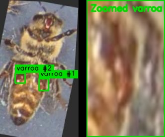
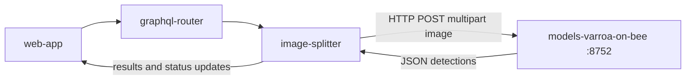

# Gratheon / models-varroa-on-bee

Machine learning microservice for detecting **varroa mites directly on bees** in hive images.

## Overview

`models-varroa-on-bee` is a dedicated detection service in the Gratheon platform.
It exposes a simple HTTP API that accepts an image and returns bounding boxes for varroa-on-bee detections.

**This model is in-house trained by Gratheon for our varroa-on-bee use case.**

## Example Detection

Example varroa-on-bee annotation on a real hive image.
Left: full frame with varroa highlights. Right: zoomed varroa region.



## Training Metrics (varroa_model5)

Validation of `best.pt` from a 10-epoch training run:

- Dataset: 1,736 images, 2,807 instances
- Dataset source: Roboflow Universe `varroa-j8231/varroa8k`, version `1` (`varroa8k.v1-testing.yolov11`)
- Dataset URL: https://universe.roboflow.com/varroa-j8231/varroa8k/dataset/1
- Dataset license: CC BY 4.0
- Training time: 0.966 hours
- Model: YOLO11n (`2,582,542` params, `6.3` GFLOPs)
- Runtime: Ultralytics `8.4.24`, Python `3.14.3`, torch `2.10.0` on Apple M3 Pro (MPS)

Overall metrics:

| Metric | Value |
|---|---:|
| Precision (Box P) | 0.926 |
| Recall (R) | 0.823 |
| mAP50 | 0.871 |
| mAP50-95 | 0.485 |

Per-class metrics:

| Class | Precision | Recall | mAP50 | mAP50-95 |
|---|---:|---:|---:|---:|
| bee | 0.995 | 0.995 | 0.995 | 0.691 |
| varroa | 0.858 | 0.651 | 0.747 | 0.280 |

Inference speed per image:

- Preprocess: 0.1 ms
- Inference: 5.3 ms
- Postprocess: 2.9 ms

## Architecture

### Service Integration Diagram



### Components

- `server.py`: Flask HTTP server and API endpoints
- `detect.py`: YOLO-based inference logic
- `yolo11n.pt`: in-house trained weights used for detection

## Development

### Start service

```bash
just start
```

### Start production compose

```bash
just start-prod
```

### Run locally without Docker

```bash
just run-local
```

Server default address: `http://localhost:8752`

### Stop service

```bash
just stop
```

### View logs

```bash
just logs
```

### Quick smoke test

```bash
just test
```

## API

### `GET /`

Returns a basic HTML upload form for manual testing.

### `GET /health`

Returns service health:

```json
{
  "message": "varroa-on-bee detector is running"
}
```

### `POST /`

Accepts `multipart/form-data` with field name `file`.

Example:

```bash
curl -X POST -F "file=@image.jpg" http://localhost:8752
```

Success response shape:

```json
{
  "message": "File processed successfully",
  "result": [
    {
      "x1": 100.0,
      "y1": 120.0,
      "x2": 180.0,
      "y2": 220.0,
      "confidence": 0.91,
      "class": 0,
      "class_name": "varroa_on_bee"
    }
  ],
  "count": 1
}
```

Error response examples:

```json
{
  "message": "Missing 'file' in multipart form data",
  "result": [],
  "count": 0
}
```

```json
{
  "message": "Empty file uploaded",
  "result": [],
  "count": 0
}
```

## Configuration

Environment variables used by the service:

- `PORT` (default: `8752`)
- `MODEL_WEIGHTS` (default: `/app/yolo11n.pt`)
- `CONF_THRES` (default: `0.25`)
- `IOU_THRES` (default: `0.45`)
- `IMG_SIZE` (default: `640`)
- `MAX_DET` (default: `20`)

## Testing

Unit tests are in `test_server.py`.

Run:

```bash
python3 test_server.py
```
